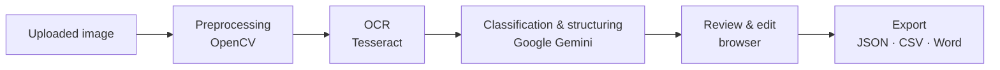

# InvoiceScan+

**Your Invoice Management Superpower**: a web application that turns photos and scans of
invoices, receipts and other administrative documents into structured, exportable data.

Upload one or more images. InvoiceScan+ cleans them up with OpenCV, reads the text with
Tesseract OCR, then uses Google Gemini to work out what kind of document it is and to
organise its content as JSON. You can review and correct the result in the browser before
downloading it as **JSON**, **CSV** or **Word** files.

> I built this during my end-of-studies internship (PFE) for my Bachelor's degree
> (Licence) in 2024. The target was Tunisian administrative documents, which mix French,
> English and Arabic.

---

## Features

- **Single or batch upload** of document images (JPEG, PNG, TIFF, WebP, …).
- **Adaptive image preprocessing**: upscaling, denoising, and a binarisation tuned to each
  image's text size.
- **Multilingual OCR** with Tesseract (English, French and Arabic).
- **AI classification and structuring**: Gemini detects the document type (invoice,
  receipt, bank statement, ID card, …) and returns the data as nested JSON, with tables
  and grouped items.
- **Review and edit** the extracted JSON in the browser, with syntax validation on both
  the client and the server.
- **Export** to JSON, CSV (flattened `field,value` rows) and Word (`.docx` with one heading
  per section), bundled in a single ZIP file.
- **History**: the Django admin keeps every scanned document, its preprocessed image and
  every exported file.

## How it works



1. **Preprocessing** (`services/preprocessing.py`): the image is upscaled ×2, converted to
   grayscale and cleaned with morphological operations. The average character height is
   estimated from contours and used to size an adaptive threshold, which turns the page
   into crisp black and white text.
2. **OCR** (`services/ocr.py`): Tesseract's LSTM engine reads the page in *sparse text*
   mode, which suits invoices because they are made of scattered blocks rather than
   paragraphs.
3. **Structuring** (`services/extraction.py`): the raw, often disordered, OCR text is sent
   to Gemini with a detailed prompt (`prompts/extraction_prompt.txt`). The model returns the
   document type and a JSON object.
4. **Review**: the user checks the JSON, fixes it if needed and submits it.
5. **Export** (`services/exporters.py`): the JSON is converted into the chosen formats and
   downloaded as a ZIP.

[`docs/ARCHITECTURE.md`](docs/ARCHITECTURE.md) covers each step, the data model and the
design decisions in more detail.

## Tech stack

| Layer          | Technology                                   |
| -------------- | -------------------------------------------- |
| Backend        | Python 3.12, Django 5                        |
| Image cleanup  | OpenCV, NumPy                                |
| OCR            | Tesseract 5 via `pytesseract`                |
| AI             | Google Gemini via the `google-genai` SDK     |
| Exports        | `csv`, `json`, `python-docx`                 |
| Frontend       | Django templates, vanilla JavaScript, CSS, Bootstrap (form controls only) |
| Database       | SQLite                                       |

## Getting started

### Prerequisites

- **Python 3.12** and [**Pipenv**](https://pipenv.pypa.io/)
- **Tesseract OCR 5** with the English, French and Arabic language packs:
  - Ubuntu/Debian: `sudo apt install tesseract-ocr tesseract-ocr-fra tesseract-ocr-ara`
  - macOS: `brew install tesseract tesseract-lang`
  - Windows: the [UB Mannheim installer](https://github.com/UB-Mannheim/tesseract/wiki);
    tick *French* and *Arabic* under "Additional language data"
- A **Google Gemini API key**, free from [Google AI Studio](https://aistudio.google.com/apikey)

### Installation

```bash
git clone https://github.com/ZiniMedAmine/InvoiceScan.git
cd InvoiceScan
pipenv install
cp .env.example .env
```

Then open `.env` and set at least `GEMINI_API_KEY`. The options are:

| Variable               | Default               | Description                                                  |
| ---------------------- | --------------------- | ------------------------------------------------------------ |
| `GEMINI_API_KEY`       | none (required)       | Google Gemini API key                                        |
| `GEMINI_MODEL`         | `gemini-2.5-flash`    | Gemini model used for structuring                            |
| `TESSERACT_CMD`        | none                  | Path to the Tesseract binary, if it is not on the `PATH`     |
| `TESSERACT_LANG`       | `eng+fra+ara`         | Tesseract language packs                                     |
| `DJANGO_DEBUG`         | `false`               | Django debug mode (`true` for local development)             |
| `DJANGO_SECRET_KEY`    | none                  | Required when debug is off                                   |
| `DJANGO_ALLOWED_HOSTS` | `localhost,127.0.0.1` | Comma-separated host names                                   |

### Run

```bash
cd invoiceScanProject
pipenv run python manage.py migrate
pipenv run python manage.py runserver
```

Then open <http://127.0.0.1:8000/>. To browse the scan history in the Django admin at
`/admin/`, first create an account with `pipenv run python manage.py createsuperuser`.

### Tests

```bash
cd invoiceScanProject
pipenv run python manage.py test invoiceScanApp
```

The tests cover preprocessing, response parsing, the exporters, the pipeline and every
view. Tesseract and Gemini are mocked, so the tests run offline and without an API key.

## Project structure

```text
InvoiceScan/
├── Pipfile                         # Python dependencies
├── .env.example                    # Configuration template
├── docs/ARCHITECTURE.md            # Technical documentation
└── invoiceScanProject/
    ├── manage.py
    ├── invoiceScanProject/         # Django project (settings, root URLs, WSGI/ASGI)
    └── invoiceScanApp/             # The application
        ├── models.py               # ScannedDocument, ExportedFile
        ├── views.py                # Upload, review, save and export endpoints
        ├── forms.py                # Multi-image upload form
        ├── urls.py
        ├── admin.py                # Scan history in the Django admin
        ├── services/               # Business logic, independent of HTTP
        │   ├── preprocessing.py    # OpenCV image cleanup
        │   ├── ocr.py              # Tesseract text recognition
        │   ├── extraction.py       # Gemini classification & JSON structuring
        │   ├── pipeline.py         # Runs the three steps on an upload
        │   └── exporters.py        # JSON / CSV / Word generation
        ├── prompts/
        │   └── extraction_prompt.txt
        ├── templates/invoiceScanApp/
        │   ├── base.html
        │   ├── home.html           # Landing page, guide and upload form
        │   └── review.html         # Review, edit and export page
        ├── static/                 # CSS, JavaScript, images, fonts, Bootstrap
        ├── migrations/
        └── tests/
```

## Limitations and ideas for improvement

- Processing is **synchronous**: large batches keep the request open for the whole scan.
  A task queue (Celery, Django-Q) with progress updates would scale better.
- Arabic text is recognised by the OCR, but the prompt asks Gemini to drop it; the output
  is French/English only.
- Gemini's JSON is free-form. With the API's structured output (`response_schema`), each
  document type could get a fixed schema, which would make CSV exports easier to merge.
- There are no user accounts: documents are tied to the browser session that uploaded them.
